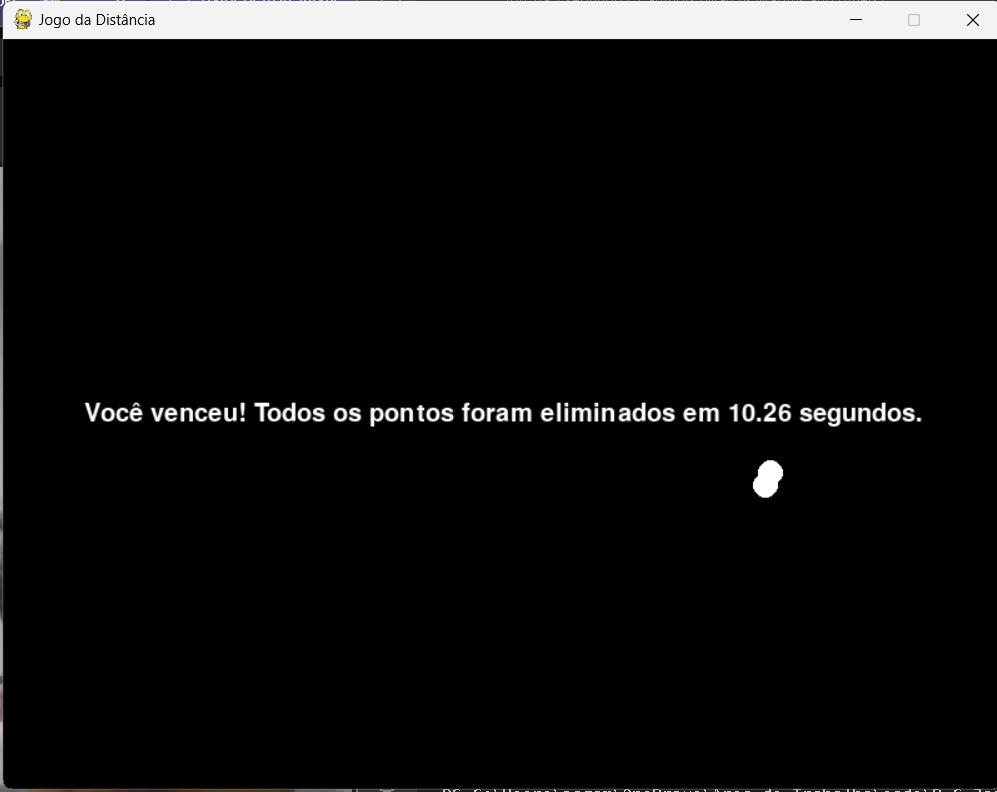
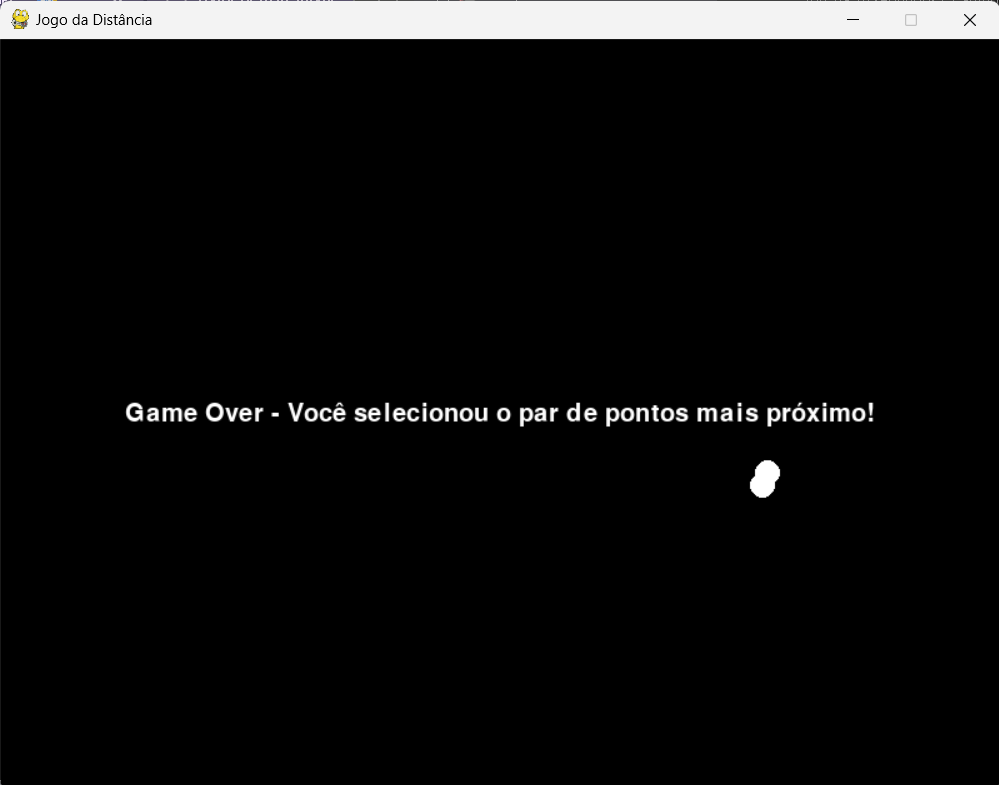
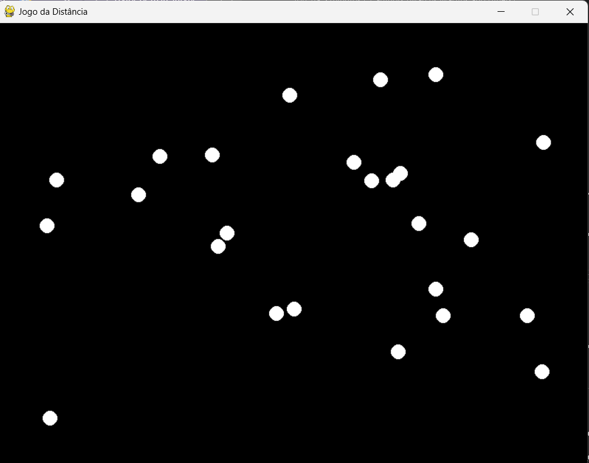

# Jogo da Distância - Pontos Mais Próximos

**Conteúdo da Disciplina**: Dividir e Conquistar<br>

## Alunos

| :Matrícula: | :Aluno                        |
| ----------- | ----------------------------- |
| 20/2023743  | Iago de Sousa Campelo Matos   |
| 21/1043683  | Marcus Vinícius Paiva Martins |

## Sobre
Um jogo sobre ficar apertando nos pontos sem apertar no par de pontos mais próximos.

Caso o jogador aperte no par de pontos mais próximos, ele perde.

## Screenshots




## Instalação
**Linguagem**: Python<br>

Para rodar o projeto, é necessário que o suporte a linguagem Python esteja instalado na máquina, assim como a ferramenta [Tkinter](https://docs.python.org/pt-br/3/library/tkinter.html).

- **Ubuntu**

  No terminal, faça:

  ```Plain Text
  sudo apt-get install python3
  sudo apt install python3-tk
  pip install pygame
  ```

  Ainda no terminal, na pasta do projeto:

  ```Plain Text
  python3 main.py
  ```

  ou

  ```Plain Text
  python3 main.py
  ```

- **Windows**

  Primeiro, faça o [download oficial da linguagem](https://www.python.org/downloads/). Depois:

  ```Plain Text
  pip install pygame
  ```

  Depois, no diretório do projeto no terminal:

  ```Plain Text
  python3 main.py
  ```

  ou

  ```Plain Text
  python3 main.py
  ```
